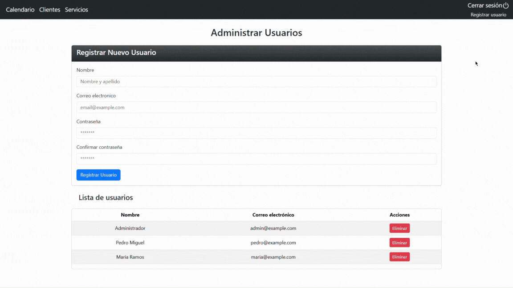

# 📅 appointment-calendar

Web application developed with **Angular 18** for **appointment management**. It allows users to organize, create, update, and delete appointments associated with clients and services. It consumes a RESTful API built with Laravel that handles all backend logic.

## 🔗 API Repository

This frontend connects to the Laravel API available at:  
➡️ [appointments-api](https://github.com/PedroMiguelSV/Appointments-api-laravel.git)

---

## 🚀 Technologies Used

- **Angular 18 (Standalone Components)** for building a modern, modular, and scalable frontend
- **Bootstrap 5** and **Bootstrap Icons** for responsive design and consistent UI styling
- **FullCalendar** for interactive calendar management
- **JWT (JSON Web Tokens)** for authentication
- **RxJS** for reactive programming
- **Laravel 11** as the backend API (separate project)

---

## 🖼️ Preview

<h3 align="center">Login screen: 💻 Desktop - 📱 Mobile</h3>

<div align="center">
  
  &nbsp;&nbsp;
  
</div>

<div align="center">
   <h3>🔐 Login, calendar, and modal</h3>
   
</div>

<div align="center">
   <h3>👥 Client management</h3>
   
</div>

<div align="center">
   <h3>💈 Service management</h3>
   
</div>

---

## 🧩 Main Features

- 🔐 Authentication with login, registration, logout, and token refresh
- 👥 Client management (create, edit, delete, real-time search)
- 💈 Service management (create, edit, delete)
- 📆 Appointment scheduling via interactive calendar:
  - Dynamic modal for creating/editing appointments
  - Automatic duration calculation based on selected services
  - Real-time client search with dropdown results
- 👤 User administration
- ✅ Validations on both frontend and backend
- 🌐 Fully translated Spanish interface

---

## 📦 Project Setup

1. Clone this repository:
   ```bash  
   git clone https://github.com/PedroMiguelSV/appointment-calendar.git  
   cd appointment-calendar  
2. Install dependencies:
   ```bash  
   npm install  
3.  Run the development server:
    ```bash
    ng serve
4. Open your browser at:
   ```bash  
   http://localhost:4200
⚠️ Important: Make sure the Laravel API (appointments-api) is running at http://localhost:8000, or update the URL in the Angular services if using a different port or domain.

---

## ⚙️ Available Scripts

🧪 Runs the app in development mode

    npm start

📦 Compiles the app for production

    npm run build

---

## 📝 Additional Notes

- 🖼️ This repository includes more screenshots inside the [`/screenshots`](./screenshots/) folder, organized by device and features.

- 🔐 To test the application, you can use the following credentials:  
Email: admin@example.com  
Password: password

> You can also register new users directly from the application or the API.

---

## 📃 License
This project is licensed under the MIT License.  